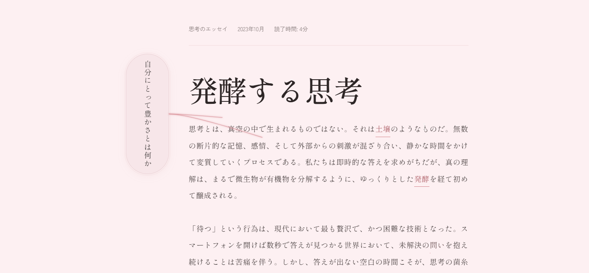

# Oryzae Writing Environment



A Japanese essay-reading interface featuring an animated mycelium (菌糸体) visual effect. As you read, glowing hyphae-like paths grow from a question capsule to connect with highlighted "spore" words in the text — a visual metaphor for the fermentation of thought.

Built with React 19, TypeScript, Vite 6, and Tailwind CSS v4.

## Features

- **Animated Mycelium Network** — SVG cubic bezier paths pulse, grow, and retract between the question capsule and spore words, mimicking fungal hyphae
- **Japanese Essay Layout** — Vertical-rl (縦書き) question capsule alongside a horizontally-set reading column, typeset with Japanese-optimized fonts (Shippori Mincho, Zen Kaku Gothic New)
- **Interactive Spore Words** — Nine words within the essay act as connection points; they highlight with an underline and colour shift when linked by an active hypha
- **Glow Effects** — Subtle SVG Gaussian-blur glow on active hyphae paths, with a linear gradient fade

## Live Demo

[https://pxnz3r.github.io/oryzae-writing-environment/](https://pxnz3r.github.io/oryzae-writing-environment/)

## Run Locally

**Prerequisites:** Node.js 18+

```bash
npm install
npm run dev
```

Open [http://localhost:3000](http://localhost:3000).

## Scripts

| Command | Description |
|---------|-------------|
| `npm run dev` | Start Vite dev server (port 3000) |
| `npm run build` | Production build to `dist/` |
| `npm run preview` | Preview production build |
| `npm run lint` | TypeScript type-check (`tsc --noEmit`) |
| `npm run clean` | Remove `dist/` directory |

## Project Structure

```
oryzae-writing-environment/
├── index.html                  Entry HTML
├── vite.config.ts              Vite + React + Tailwind config
├── tsconfig.json               TypeScript configuration
├── package.json                Dependencies and scripts
├── translation.md              English translation of all Japanese text
├── metadata.json               AI Studio metadata
├── chrome_1tUR1726jR.png       Screenshot
└── src/
    ├── main.tsx                React entry point
    ├── App.tsx                 Root component — composes the layout
    ├── index.css               Tailwind imports, theme tokens, keyframes
    ├── hooks/
    │   └── useMyceliumAnimation.ts  Animation loop, path lifecycle, coordinate math
    └── components/
        ├── MyceliumCanvas.tsx       SVG overlay (defs + rendered paths)
        ├── QuestionCapsule.tsx      Vertical-rl source capsule
        └── EssayArticle.tsx         Essay content with spore words
```

## Animation Lifecycle

Each mycelium path has three phases managed by the `useMyceliumAnimation` hook:

1. **Growing** — stroke-dashoffset shrinks from the path length to 0, drawing the line from capsule to spore
2. **Sustained** — the full path remains visible for 100–300 frames (~1.7–5 s)
3. **Dying** — stroke-dashoffset grows back, retracting the path; the spore is then released

Up to three simultaneous connections are allowed. New connections spawn randomly (~5 % chance per frame) from unconnected spore words.

For full technical details, see [docs/ANIMATION.md](docs/ANIMATION.md).

## Tech Stack

- **React 19** — UI framework
- **TypeScript** — Type safety
- **Vite 6** — Build tool with HMR
- **Tailwind CSS v4** — Utility-first styling with `@tailwindcss/vite` plugin

## License

Apache 2.0
